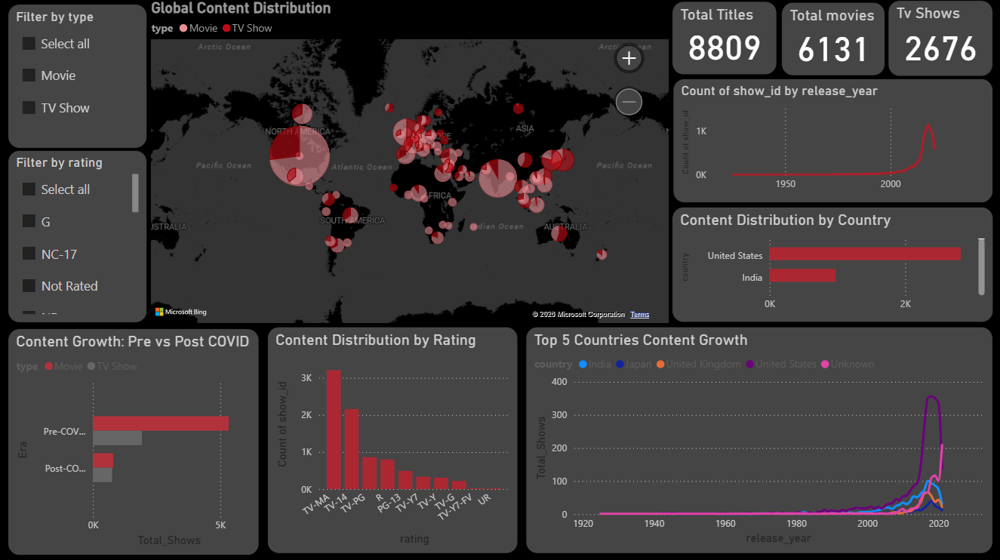

# 🎬 Netflix Content Evolution & Audience Trends Analysis

## 🚀 Overview

This project analyzes Netflix content using Python and Power BI to uncover trends in content growth, distribution, and ratings.

## 🛠️ Tools Used

* Python – Data cleaning & analysis
* Power BI – Dashboard visualization

## 📊 Dashboard Preview

## 🐍 Python Analysis

Exploratory data analysis was performed using Python to identify key trends:

* 📈 Content growth over time
* 🌍 Top countries producing content
* 🎭 Distribution of ratings

### Sample Visuals:

## 📂 Project Structure

* `dashboard/` → Power BI file
* `screenshots/` → images
* `python/` → analysis script
* `data/` → dataset

## 🎯 Key Insights

* Content increased rapidly after 2020
* United States dominates, India is growing
* TV-MA and TV-14 are most common ratings
